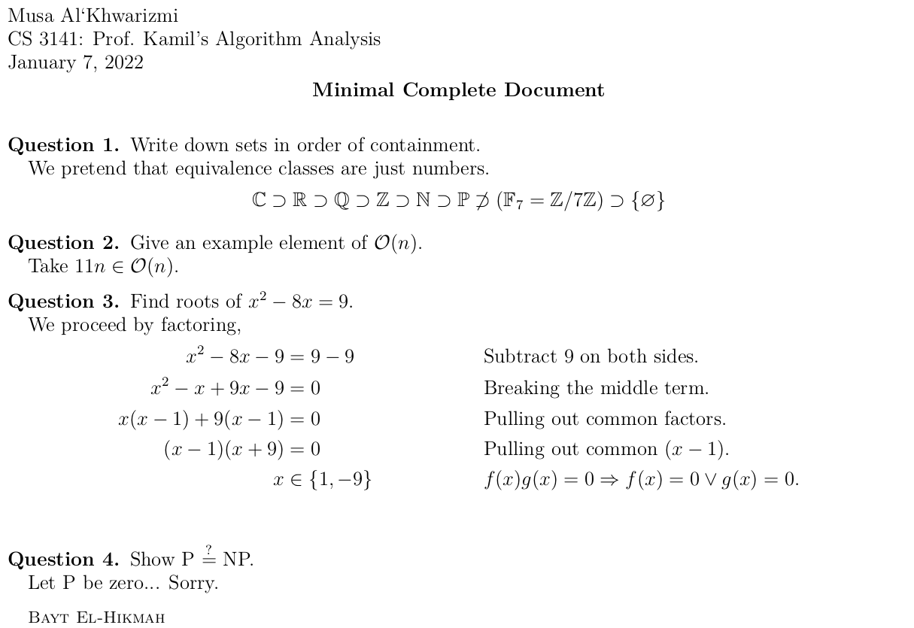
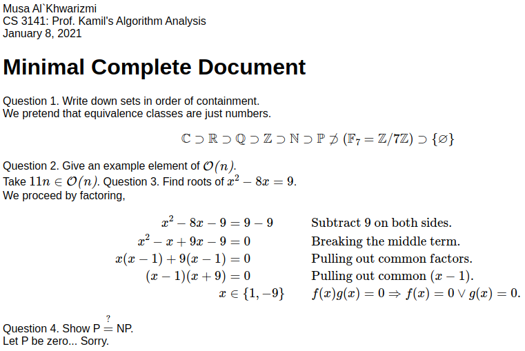

<p align="center"></p>
<h1 align="center">Beautiful Homework in LaTeX</h1>

We provide,

1. [`homework.cls`][0]: A latex class extending the [AMS
   article](https://www.ctan.org/pkg/amsart) for better typeset
   homework. This class imports the next three packages for symbol
   shortcuts and code listings.
2. [`hwcmd.sty`][4]: A collection of shortcuts for environments like
   figure and tabular.
3. [`hwlst.sty`][1]: A collection of configurations and additions to
   the [Listings](https://www.ctan.org/pkg/listings) package.
4. [`hwsymb.sty`][2]: Defines a lot of useful shortcuts for bigger
   macros, e.g., `\Z` for `\mathbb{Z}`.
5. [`hwjax.js`][3]: A [MathJax v3](https://www.mathjax.org/) custom
   component that packs `'ams', 'newcommand', 'configmacros',
   'action', 'require', 'autoload', 'hwsymb'` in one Javascript file.

## Getting Started

The quickest way to test-drive the packages here is on
[Overleaf](https://www.overleaf.com/latex/templates/overleaf-homework-template/tjpxvcfnrqpd). Bellow
we talk about what we need to get a minimal example up and
running on your personal machine. For more,

- [Documentation](examples/latex/documentation.pdf)

### Prerequisites

If you want to use the LaTeX homework class `homework.cls` or one of
the style packages `*.sty` (on your own computer) then you'll need to
have one of the distributions of LaTeX installed and a text editor,
there are some good ones for editing `*.tex` files; I use Emacs with
AucTeX. For the LaTeX distribution, I recommend [TeX
Live](https://tug.org/texlive/).

If you just want to write Markdown or HTML files and want to use the
symbols (with some macros and environments) defined by the AMS article
packages and their shortcuts by our packages then you only need the
`hwjax.js` file.

### Examples

For LaTeX, [get the homework class and style
files](https://www.wikihow.com/Download-a-File-from-GitHub) and place
them in the same directory as your latex document (`*.tex`). Or, if
you want them available globally, [read
this](https://tex.stackexchange.com/a/1141/215221). Here is a complete
valid document.

```latex
\documentclass{homework}
\author{Musa Al`Khwarizmi}
\class{CS 3141: Prof. Kamil's Algorithm Analysis}
\date{\today}
\title{Minimal Complete Document}
\address{Bayt El-Hikmah}

\begin{document} \maketitle

\question Write down sets in order of containment.

We pretend that equivalence classes are just numbers.
\[
  \C \supset \R \supset \Q \supset \Z \supset \N \supset
  \P \not\supset (\GF[7] = \modulo[7])  \supset \{\nil\}
\]

\question Give an example element of $\O(n)$.

Take $11n \in \O(n)$.

\question Find roots of $x^2- 8x = 9$.

We proceed by factoring,
\begin{align*}
  x^2- 8x - 9         &= 9-9 && \text{Subtract 9 on both sides.}         \\
  x^2- x + 9x - 9     &= 0   && \text{Breaking the middle term.}         \\
  x(x - 1) + 9(x - 1) &= 0   && \text{Pulling out common factors.}       \\
  (x - 1)(x + 9)      &= 0   && \text{Pulling out common } (x - 1).      \\
  x           &\in \{1, -9\} && f(x)g(x) = 0 \Ra f(x) = 0 \vee g(x) = 0. \\
\end{align*}

\question Show P $\?$ NP.

Let P be zero... Sorry.
\end{document}

```

Upon compilation, you'll get a PDF that looks something like
[this](examples/latex/minimal.pdf) (margins, page-number and some
white-space has been cropped for brevity),

<p align="center"></p>

For markup, you'll need the following script tag: `<script async
src="path/to/hwjax.js"></script>`. Here is a complete example:

```html
<!DOCTYPE html>
<html><head><script async src="hwjax.js"></script></head>
<body style="font-family:sans-serif">
  Musa Al`Khwarizmi<br>
  CS 3141: Prof. Kamil's Algorithm Analysis<br>
  January 8, 2021<br>
  
  <h1>Minimal Complete Document</h1>
  
  Question 1. Write down sets in order of containment.<br>
  We pretend that equivalence classes are just numbers.
  \[
  \C \supset \R \supset \Q \supset \Z \supset \N \supset \P
  \not\supset (\GF[7] = \modulo[7])  \supset \{\nil\}
  \]

  Question 2. Give an example element of $\O(n)$.<br>
  Take $11n \in \O(n)$.

  Question 3. Find roots of $x^2- 8x = 9$.<br>
  We proceed by factoring,
  \begin{align*}
  x^2- 8x - 9         &= 9-9         && \text{Subtract 9 on both sides.}         \\
  x^2- x + 9x - 9     &= 0           && \text{Breaking the middle term.}         \\
  x(x - 1) + 9(x - 1) &= 0           && \text{Pulling out common factors.}       \\
  (x - 1)(x + 9)      &= 0           && \text{Pulling out common } (x - 1).      \\
  x                   &\in \{1, -9\} && f(x)g(x) = 0 \Ra f(x) = 0 \vee g(x) = 0. \\
  \end{align*}

  Question 4. Show P $\?$ NP.<br>
  Let P be zero... Sorry.
</body></html>
```

This html file will look like this in the browser.

<p align="center"></p>

You can find more example documents in the examples
[folder](./examples/).

## Built With

* [TeX Live](https://tug.org/texlive/) - My LaTeX distribution.
* [Mathjax](https://www.mathjax.org/) - A JavaScript display engine
  for mathematics that works in all browsers.
  - [Node and NPM](https://nodejs.org/en/) - The Javascript Engine and
    its package manager.

To build your own `hwjax.js` from source, you can navigate to the
[mathjax source directory](src/mathjax/). There, first run `npm
install` followed by the `npm run build`. Afterwards, extract the
`hwjax.min.js` from the `./src/mathjax/hwjax/` directory.

For more, read [_Building a Custom Component_](https://docs.mathjax.org/en/latest/web/webpack.html#building-a-custom-component)

## Authors

* moi-même `¯\_( ͡❛ ͜ʖ ͡❛)_/¯`

## License

Copyright (C) 2020 Ahmad Tashfeen

This program is free software: you can redistribute it and/or modify
it under the terms of the GNU General Public License as published by
the Free Software Foundation, either version 3 of the License, or (at
your option) any later version.

This program is distributed in the hope that it will be useful, but
WITHOUT ANY WARRANTY; without even the implied warranty of
MERCHANTABILITY or FITNESS FOR A PARTICULAR PURPOSE.  See the GNU
General Public License for more details.

You should have received a copy of the [GNU General Public
License](COPYING) along with this program.  If not, see
<https://www.gnu.org/licenses/>.


## Acknowledgements

* [Paul Fili](https://math.okstate.edu/people/fili/): For showing me
  LaTeX and being one of *the* best teachers!

[0]: https://raw.githubusercontent.com/simurgh9/hw/master/src/latex/homework.cls
[1]: https://raw.githubusercontent.com/simurgh9/hw/master/src/latex/hwlst.sty
[2]: https://raw.githubusercontent.com/simurgh9/hw/master/src/latex/hwsymb.sty
[3]: https://raw.githubusercontent.com/simurgh9/hw/master/examples/mathjax/hwjax.js
[4]: https://raw.githubusercontent.com/simurgh9/hw/master/src/latex/hwcmd.sty
